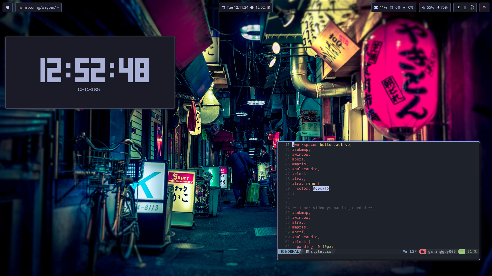

# Configs / Dotfiles

This repository contains some of my personal dotfiles for various usecases and distros. I'll try to keep this as organized as I can although I can't guarantee it lol

## Nixos

The nixos folder contains configs for various setups also including homemanager and theming. I might add more as I progress.

## Fedora

This contains my desktop Fedora Hyprland setup including a few of the utilities configs like fuzzel

Used tools are:
    - fuzzel
    - kora-icon-theme
    - kitty
    - gnome qt theme
    - phinger cursors
    - waybar
    - hyprpaper
    - lxpolkit
    - kdeconnect
    - nextcloud desktop
    - openrgb
    - dunst
    - playerctl
    - input-remapper-control
    - nemo
    - hyprlock
    - hyprshot
    - copyq

